# User.md — AI Collaboration User Assessment

A psychometric-style assessment that produces a portable, personalized user-collaboration
profile (`USER.md` / a personalized `AGENTS.md`). The pipeline: a 60-item questionnaire →
scoring & response-quality detection → consistency check → LLM-generated profile →
user confirmation → deliverable `USER.md`. Every stage is agent-agnostic: the instrument,
scoring, and generation all run independently, and the whole thing is packaged as a
reusable skill (`skill/user-collab-profile/`).

**Status: MVP complete and verified against real responses. The current profile is a
test artifact — NOT deployed to `~/.agents/USER.md`.**

## Pipeline

```mermaid
graph LR
    Q[questionnaire.json<br/>60 items · zh + en] --> G[make_quiz.py<br/>builds quiz.html]
    G --> H[quiz.html<br/>answers in local browser<br/>i18n + optional EXT field]
    H -->|answer string| P[parse_answers.py]
    P --> S[score.py<br/>scoring + quality checks]
    S --> C[consistency_check.py<br/>cross-dimension conflicts]
    C --> L[generate_prompt.md<br/>+ call_llm profile generation]
    L --> U[confirmation loop<br/>10 statements + conflict adjudication]
    U -->|confirmed| W[USER.md + user-profile.json]
```



## Layout

| Path | What it is |
|------|------------|
| `questionnaire.json` | Item bank: 51 rating items (1–5 anchored) + 6 contextual + 2 quality + 1 language item, bilingual |
| `translations_en.json` | English translation source (re-merge after editing items) |
| `make_quiz.py` / `quiz.html` | Quiz generator / self-contained form (live language switch on LANG, optional EXT free text, calibration-ruler theme) |
| `parse_answers.py` | Answer string → answers JSON (tolerant separators, value-range checks, EXT percent-decoding) |
| `score.py` | 10-dimension scoring + quality detection (attention / consistency / extreme / mixed / low-discrimination) |
| `consistency_check.py` | D4×D5 quadrant rule + cross-dimension conflict detection |
| `generate_prompt.md` | LLM generation template (report / 10 confirmation statements / adjudication / USER.md draft, incl. EXT handling) |
| `agents.json` | agent 环境约定（检测信号 / 文档名 / 全局路径），可改 |
| `detect_env.py` | 检测当前 agent 环境（env 变量 + 目录信号，自动/强制/JSON） |
| `render_profile.py` | 规范画像 → 目标 agent 文档（CLAUDE.md / AGENTS.md / USER.md，含首行标题改写与覆盖保护） |
| `skill/user-collab-profile/` | Reusable skill package (SKILL.md + full file set; triggers on `[skill:user-collab-profile]`) |
| `docs/` | `plan.md` (design plan & revision log v2.3), `pipeline.md` (scale design & validation records) |
| `demo/` | Generated demos (v1.2 current + v1.1 historical) |
| `test-runs/` | Test artifacts: `synthetic/` (4 simulated answer sets: normal / careless / satisficing / roundtrip), `captain/` (two real answer rounds, v1.2 & v3) |

## Quick start

```bash
# 1. Build the quiz (quiz.html ships with the repo; re-run after item edits)
python3 make_quiz.py

# 2. Open quiz.html in a browser, answer, copy the answer string

# 3. Parse the answer string → answers JSON
python3 parse_answers.py -s 'LANG=en;T1=4;...' -o answers_me.json

# 4. Score + quality check + consistency check
python3 score.py answers_me.json --out profile.json
python3 consistency_check.py profile.json --out conflicts.json

# 5. Generate the profile with an LLM: call_llm, attachments =
#    generate_prompt.md + profile.json + conflicts.json
#    (include any EXT user-supplied text in the prompt)
# 6. Confirmation loop → write USER.md + user-profile.json
```

## Key design decisions

- **5-point anchored scale** (1 Strongly disagree → 5 Strongly agree): consistent with
  IPIP/Big Five practice; every level is nameable, eliminating the reference-frame
  ambiguity of a 1–10 scale.
- **Relative bands as primary output** (`rel_band`, dimension vs. the person's own mean
  ±0.25): empirically stable across strict/lenient response styles (10/10 match on both
  simulation styles), where absolute bands flip (the MVP defect fixed in v1.2).
- **Real i18n**: all 59 items fully translated; selecting LANG switches the entire UI
  live (zh / en / bilingual).
- **Optional EXT field**: free text percent-encoded into the answer string, decoded
  losslessly at parse time, and treated as a first-class generation input (facts →
  work context, preferences → candidate behavioral rules, hard requirements →
  directly into USER.md, noise → discarded).
- **Quality detection**: `attention_failed` (attention items), `consistency_mismatch`
  (CC1 vs S3), `extreme_responding` (all-extreme answers), `low_discrimination`
  (over-concentrated scores), `mixed_dimension` (within-dimension std > 1.25,
  confidence dropped to 0.75).
- **Mandatory confirmation loop**: the generated profile is a hypothesis, not fact —
  the 10 confirmation statements and conflict adjudication must pass before landing.

## Environment detection

The profile is rendered into the document format of the agent the user is actually running:

| Agent | Document | Global memory path | Detection signals |
|-------|----------|--------------------|--------------------|
| Craft Agent | `USER.md` (+ `user-profile.json`) | `~/.agents/USER.md` | `CRAFT_*` env vars |
| Claude Code | `CLAUDE.md` | `~/.claude/CLAUDE.md` | `CLAUDE_CODE` env / `~/.claude` dir |
| OpenAI Codex | `AGENTS.md` | `~/.codex/AGENTS.md` | `CODEX_HOME` env / `~/.codex` dir |
| opencode | `AGENTS.md` | `~/.config/opencode/AGENTS.md` | `OPENCODE` env / `~/.config/opencode` dir |
| WorkBuddy | `AGENTS.md` | `~/.workbuddy/AGENTS.md` (provisional) | `WORKBUDDY` env / `~/.workbuddy` dir |

```bash
python3 detect_env.py                 # auto-detect current agent
python3 detect_env.py --list          # list all installed agents
python3 render_profile.py USER.md --agent claude --dest project   # → ./CLAUDE.md
python3 render_profile.py USER.md --agent craftagent --dest global # → ~/.agents/USER.md
```

`--dest project` writes next to the current directory (safe default); writing to a
global memory path requires an explicit `--dest global`. All conventions live in
`agents.json` — one edit to adjust any path. WorkBuddy's path is a best-guess
convention (web verification pending).

## Validation highlights

- 5-point simulations: normal passes; satisficing → extreme + mixed + low-discrimination;
  careless → attention failure + consistency mismatch.
- Strict/lenient style simulation: relative bands match the real profile 10/10.
- Two real answer rounds (`test-runs/captain/`): 4 mixed dimensions in v1.2 → 3 in v3
  (D1 became consistent); profile confirmed by the user.
- Browser E2E: language switching / EXT encode-decode round trip / 61-item submit →
  parse → score, all passing.

## Backlog

- D11 iteration-tempo dimension; configurable living thresholds; small-sample
  reliability (α ≥ 0.6); norms/percentiles; forced-choice items for
  decision-critical dimensions.
- Go-live: deploy `test-runs/captain/v3`'s `USER.md` + `user-profile.json` to
  `~/.agents/` when ready.

---

*Other languages: [中文版 README](README.zh-CN.md)*
