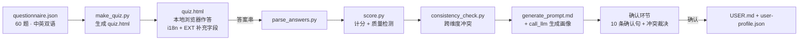

# User.md — AI 协作用户认知测评

[](https://opensource.org/licenses/MIT)

生成可携带的用户协作画像（USER.md / 个性化 AGENTS.md）：一份 60 题心理测量式问卷 →
计分与质量检测 → 一致性检查 → LLM 生成 → 用户确认 → 落地。问卷、计分、生成全链路
与 agent 无关，可独立运行，也可打包为 skill（`skill/user-collab-profile/`）复用。

**状态：MVP 已完成并通过真实作答验证；当前产物为测试画像，未部署到 `~/.agents/USER.md`。**

## 流程总览



## 目录结构

| 路径 | 内容 |
|------|------|
| `questionnaire.json` | 题项库：51 打分（1-5 带锚点）+ 6 情境 + 2 质检 + 1 语言题，中英双语 |
| `translations_en.json` | 英文翻译源（改题后重新合并） |
| `make_quiz.py` / `quiz.html` | 问卷生成器 / 自包含表单（LANG 实时切换语言、可选 EXT 自由文本、校准标尺主题） |
| `parse_answers.py` | 答案串 → answers JSON（容忍分隔符、校验值域、EXT 百分号解码） |
| `score.py` | 10 维度计分 + 质量检测（attention/consistency/extreme/mixed/low_discrimination） |
| `consistency_check.py` | D4×D5 象限规则 + 跨维度冲突检测 |
| `generate_prompt.md` | LLM 生成模板（画像报告 / 十条确认句 / 冲突裁决 / USER.md 草案，含 EXT 处理） |
| `agents.json` | agent 环境约定（检测信号 / 文档名 / 全局路径），可改 |
| `detect_env.py` | 检测当前 agent 环境（环境变量 + 目录信号，自动/强制/JSON） |
| `render_profile.py` | 规范画像 → 目标 agent 文档（CLAUDE.md / AGENTS.md / USER.md，含首行标题改写与覆盖保护） |
| `skill/user-collab-profile/` | 可复用 skill 包（SKILL.md + 全量文件，`[skill:user-collab-profile]` 触发） |
| `docs/` | `plan.md`（设计计划与修订记录 v2.3）、`pipeline.md`（量表设计与验证记录） |
| `demo/` | 演示稿（v1.2 现版 + v1.1 历史） |
| `test-runs/` | 测试产物：`synthetic/` 仿真四组（normal/careless/satisficing/roundtrip）、`captain/` 真实作答两轮（v1.2 与 v3） |

## 快速开始

```bash
# 1. 生成问卷（已含 quiz.html，题目改动后重跑）
python3 make_quiz.py

# 2. 浏览器打开 quiz.html 作答，复制答案串

# 3. 解析答案串 → answers JSON
python3 parse_answers.py -s 'LANG=zh;T1=4;...' -o answers_me.json

# 4. 计分 + 质量检测 + 一致性检查
python3 score.py answers_me.json --out profile.json
python3 consistency_check.py profile.json --out conflicts.json

# 5. 用 LLM 生成画像：call_llm，attachments 传 generate_prompt.md + profile.json + conflicts.json
#    （有 EXT 补充信息则一并写入 prompt）
# 6. 确认环节 → 落盘 USER.md + user-profile.json
```

## 关键设计决策

- **5 档带锚点**（1 完全不同意 → 5 完全同意）：与 IPIP/大五一致，每档可命名，消除 1-10 量表的参照系歧义。
- **相对档位为主输出**（rel_band，维度 vs 本人均值 ±0.25）：实测严苛/宽松打分风格下
  相对档位 10/10 稳定，绝对档位会翻转（v1.2 修复的 MVP 缺陷）。
- **真 i18n**：59 题全量英译，LANG 选中后全界面实时切换（zh/en/双语）。
- **EXT 可选补充字段**：自由文本百分号编码进答案串，解析原样还原，生成时作为一等输入
  （事实→工作背景、偏好→行为指令、硬要求→直接进 USER.md、噪声→丢弃）。
- **质量检测**：`attention_failed`（注意力题）、`consistency_mismatch`（CC1 vs S3）、
  `extreme_responding`（全极值）、`low_discrimination`（分值过度集中）、
  `mixed_dimension`（维内 std>1.25，降置信度至 0.75）。
- **确认环节强制**：生成结果只是假设，10 条确认句 + 冲突裁决通过后才可落地。

## 环境检测

画像会渲染为用户实际运行的那个 agent 的文档格式：

| Agent | 文档 | 全局记忆路径 | 检测信号 |
|-------|------|--------------|----------|
| Craft Agent | `USER.md`（另附 user-profile.json） | `~/.agents/USER.md` | `CRAFT_*` 环境变量 |
| Claude Code | `CLAUDE.md` | `~/.claude/CLAUDE.md` | `CLAUDE_CODE` 环境变量 / `~/.claude` 目录 |
| OpenAI Codex | `AGENTS.md` | `~/.codex/AGENTS.md` | `CODEX_HOME` 环境变量 / `~/.codex` 目录 |
| opencode | `AGENTS.md` | `~/.config/opencode/AGENTS.md` | `OPENCODE` 环境变量 / `~/.config/opencode` 目录 |
| WorkBuddy | `AGENTS.md` | `~/.workbuddy/AGENTS.md`（暂定） | `WORKBUDDY` 环境变量 / `~/.workbuddy` 目录 |

```bash
python3 detect_env.py                  # 自动检测当前 agent
python3 detect_env.py --list           # 列出全部已安装 agent
python3 render_profile.py USER.md --agent claude --dest project    # → ./CLAUDE.md
python3 render_profile.py USER.md --agent craftagent --dest global # → ~/.agents/USER.md
```

`--dest project` 默认写到当前目录（安全默认）；写全局记忆路径需显式 `--dest global`。
所有约定集中在 `agents.json`，改路径只需改一处。WorkBuddy 路径为暂定约定（待官网核实）。

## 验证记录（要点）

- 五档仿真：normal 通过；satisficing → extreme + mixed + low_discrimination；careless → attention 失败 + CC 矛盾。
- 严苛/宽松风格仿真：相对档位与真实画像 10/10 一致。
- 真实作答两轮（test-runs/captain/）：v1.2 轮 4 个 mixed 维度 → v3 轮降至 3 个（D1 恢复一致），画像已确认。
- 浏览器 E2E：语言切换 / EXT 编码回路 / 61 项提交 → 解析 → 计分全通。

## Backlog

- D11 迭代节奏维度；living 阈值可配置；小样本信度（α≥0.6）；常模/百分位；
  决策关键维度强制选择式（forced-choice）题。
- 正式启用：将 test-runs/captain/v3 的 USER.md + user-profile.json 部署到 `~/.agents/`。
