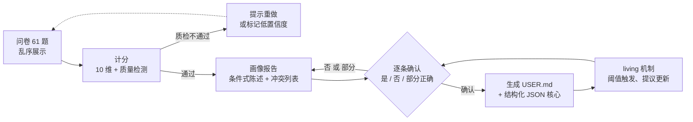

# 用户认知测评 → 自动生成个性化 AGENTS.md（USER.md）

> 版本：v2.0 草案 · 2026-08-02 · 作者：Captain + Craft Agent
> v2.0 合并了外部评审修正（见 §11 修订记录）

## 1. 定位与目标

**核心命题**：AGENTS.md/CLAUDE.md 正在从"约束 AI 的行为准则"演化为"AI 对用户的认知模型"。但大多数用户无法准确描述自己（自我认知盲区 + 不会表达），因此需要一个**测评式工具**：用户只需回答简单的 1-10 打分和是/否，系统自动生成一份个性化、可跨 agent 复用的协作档案（USER.md）。

**产品形态**：问卷 + 计分 + 生成 = "AI 协作版性格测评"，副产品是帮助用户更好地认识自己。

**三个支柱**：

1. **间接测量**——用户直接说"我想要详细的回答"往往失真（社会赞许偏差）；行为化题项的间接推断更接近真实。
2. **冷启动 + 持续校准**——问卷是一次性冷启动；档案是 living document，AI 在使用中观察到模式时提议更新。
3. **人类确认兜底**——所有推断都呈现给用户逐条确认，测评输出是"假设"而非"事实"。

## 2. 现状（已调研）

- **AGENTS.md 是真实标准**：由 [Agentic AI Foundation](https://agents.md)（Linux Foundation 旗下）治理，OpenAI Codex、Cursor、Gemini CLI、VS Code 等生态普遍支持。无强制字段，纯 Markdown，"living documentation"。
- **用户级记忆已有雏形**：Claude Code 支持 `~/.claude/CLAUDE.md` 用户级文件；本系统（Craft）有内置 `preferences.json`。
- **空白点**：还没有人做"心理测评式问卷 → 自动生成用户模型"的完整流水线。题项地基可免费使用 [IPIP](https://ipip.ori.org/)（3,320 条公有领域题项，含大五量表与作答有效性检测方法）。

## 3. 测评设计

### 3.1 十个维度

| # | 维度 | 高分含义 | 回答的问题 |
|---|------|---------|-----------|
| D1 | 粒度 Granularity | 要细节、分步、详尽 | 先框架还是先深入？回复详尽还是简洁？ |
| D2 | 具体-抽象 Abstraction | 要例子、通俗解释 | 例子 vs 原理？ |
| D3 | 教学倾向 Teaching | 想学、想理解 | 教我做还是替我做？ |
| D4 | 自主权 Autonomy | 需要先确认 | 先问还是先做？ |
| D5 | 主动性 Proactivity | 想要 AI 主动 | 主动建议还是只做交代的事？ |
| D6 | 反馈-挑战 Feedback | 接受直接质疑 | 顺着我还是挑战我？ |
| D7 | 风险偏好 Risk | 保守、审慎（想透再做） | 保守 vs 实验？ |
| D8 | 不确定性沟通 Uncertainty | 要区分事实/推测 | 要不要明确置信度？ |
| D9 | 表达形式 Expression | 正式、结构化、规范 | 什么语气和格式？ |
| D10 | 角色定位 Role | 同事/导师 | AI 是工具、同事还是导师？ |

> **设计注**：D9 是复合因子（正式度 × 结构化 × 规范度），三者在概念上相关但不等同；v1.1 视信度检验结果决定是否拆分"结构化"为独立小维（§10）。D7 的 R1 原题因构念污染已替换（见 §3.3 说明）。

### 3.2 题型结构（60 题，10–12 分钟）

| 题型 | 数量 | 用途 |
|------|------|------|
| 起始语言题（LANG） | 1 | 问卷开始前识别用户语言：中文 / English / 双语，决定问卷界面与生成语言 |
| 1–5 打分（带锚点标签，行为陈述句，同意程度） | 51 | 十个维度的原始测量（D1 含 6 题，D9 含 5 题，其余各 5 题） |
| 是/否（情境事实题） | 6 | 工作背景、记忆偏好（语言改由 LANG 承担，消除冗余） |
| 一致性检测（是/否） | 1 | 前后逻辑校验 |
| 注意力检测 | 1 | 检测乱答/敷衍作答 |

**展示顺序（重要）**：问卷**交叉乱序**呈现——同维度题项不相邻、反向题分布均匀。避免连续同维诱导作答（前题锚定后题）、反向题被猜出。`questionnaire.json` 中内置展示顺序字段，计分按维度键而非顺序。

### 3.3 完整题项草稿

> 标注：`F`=正向计分，`R`=反向计分（原始分取 11-原始分）。

**D1 粒度**（高分 = 细节/分步/详尽）
- G1 (R)：我喜欢先看到整体框架，再进入细节。
- G2 (R)：给 AI 布置任务时，目标说清楚即可，实现细节由 AI 自己把握。
- G3 (F)：我希望 AI 分步骤展示进度，而不是一次性给出全部结果。
- G4 (R)：答案中细节过多会让我觉得信息过载。
- G5 (F)：我更信任附有具体代码、数据和证据的回答。
- G6 (R)：我偏好简洁的回复，不要过度展开。（自 D9 移入——原题测的是信息密度，与正式度非同构）

**D2 具体-抽象**（高分 = 要例子/通俗）
- A1 (F)：解释概念时，一两个具体例子比抽象定义更有用。
- A2 (F)：我习惯通过类比来理解新概念。
- A3 (R)：解释问题时，抽象原理就够了，具体例子我自己能想出来。（重写——原"背景原理自己补"与 D3 的 T3 近似重复，且偏教学构念）
- A4 (F)：遇到不熟悉的领域，我希望 AI 用通俗的说法把概念讲清楚。
- A5 (R)：我更喜欢严密的技术术语，而不是通俗化解释。

**D3 教学倾向**（高分 = 想学）
- T1 (F)：我更希望 AI 教给我方法和思路，而不是替我把事做完。
- T2 (F)：我宁可自己动手做，只要 AI 能及时纠正我。
- T3 (R)：我的目标是尽快拿到结果，过程有没有学会不重要。
- T4 (F)：我希望 AI 解释"为什么这样做"，而不只是"怎么做"。
- T5 (R)：同一类任务 AI 做过一次后，我希望它直接代劳。

**D4 自主权**（高分 = 需要先确认）
- U1 (F)：即使风险很低，我也希望 AI 动手前先说明它打算做什么。
- U2 (F)：涉及删除、重写或移动文件的操作，必须先得到我的明确同意。
- U3 (R)：常规、无风险的操作，AI 可以直接执行。
- U4 (F)：给出修改建议前，我希望 AI 先展示将要改变的内容。
- U5 (R)：探索性任务，AI 可以直接尝试，不必每一步都问我。

**D5 主动性**（高分 = 想要主动）
- P1 (F)：我希望 AI 主动发现并提出我没提到的问题。
- P2 (F)：任务完成后，AI 主动建议下一步是有价值的。
- P3 (R)：我不喜欢 AI 给我没要求的额外建议。
- P4 (F)：如果我的做法有更优路径，我希望 AI 主动提出来。
- P5 (R)：AI 只做我交代的事就好，不用多想。

**D6 反馈-挑战**（高分 = 接受直接质疑）
- FB1 (F)：我的想法有明显缺陷时，我希望 AI 直接指出，而不是顺着我。
- FB2 (F)：比起委婉表达，我更喜欢直接了当的反馈。
- FB3 (R)：如果 AI 有不同的方案，应该先按我的方案来，再讨论。
- FB4 (F)：我欢迎 AI 质疑技术方案，即使我最终可能坚持己见。
- FB5 (R)：我需要被认可，AI 应该多肯定我。

**D7 风险偏好**（高分 = 保守审慎）
- R1 (F)：我倾向于在动手前把方案想透了，而不是边做边改。
- R2 (F)：面对不确定的选择，我宁可多花时间确认，也不想事后返工。
- R3 (R)：我享受尝试新的、未经检验的做法。
- R4 (F)：重大改动前，我希望有充分的验证和检查点。
- R5 (R)：新方法即使有风险，只要收益够大就值得尝试。

> **替换说明**：原 R1"先推出能用的最小版本，再逐步完善"因**构念污染**移除——保守者（小步验证、避免不可逆大失败）与实验者（快速试错迭代）都会同意该题，无区分度；且它实为"迭代节奏"构念（见 §10 D11），不属于风险偏好。**反转计分无法修复歧义，只能换题。**

**D8 不确定性沟通**（高分 = 要区分事实/推测）
- X1 (F)：当 AI 不确定时，我希望它明确说"我不确定"，而不是自信地猜测。
- X2 (F)：我希望 AI 区分"事实"和"推测"。
- X3 (R)：只要答案大致正确，我不在乎 AI 是否说明置信度。
- X4 (F)：做重要决定时，我会追问 AI 的证据来源和可靠程度。
- X5 (R)：AI 的答案听起来越确定，我越放心。

**D9 表达形式**（正式度 × 结构化 × 规范度）
- S1 (F)：我更喜欢正式的书面表达，而不是随意的聊天口吻。
- S2 (R)：轻松、随意的语气让我感觉更自然。
- S3 (F)：我希望 AI 用结构化格式（列表、表格）组织信息。
- S4 (F)：我希望 AI 使用准确的标点、完整的句子和规范的格式。
- S5 (R)：AI 的回复实用就好，不必讲究书面正式感。（新增反向题，维持每维 ≥2 反向）

**D10 角色定位**（高分 = 同事/导师）
- C1 (F)：对我来说，AI 更像是经验丰富但尊重我判断的同事。
- C2 (R)：AI 是一个工具，我应该掌握所有决策权。
- C3 (F)：我希望 AI 在合适时机主动给出自己的建议，而不只是执行。
- C4 (R)：重要决策应该由我做，AI 只负责提供信息。
- C5 (F)：我愿意让 AI 参与讨论和权衡，而不是只听指令。

**起始语言题（问卷开始前）**
- LANG：中文 / English / 双语 —— 决定问卷界面与生成语言；同时消除原 Y3/Y4（交流语言）与生成语言判断的冗余。

**情境事实题（是/否）**
- Y1：我的工作以写代码为主。
- Y2：我的工作以写作/文档为主。
- Y5：我希望 AI 记住我的长期偏好和工作背景。
- Y6：我经常在多个任务之间切换。
- Y7：我通常一次只专注做一件事。
- Y8：我更习惯晚上/深夜工作。

**质量检测题**
- CC1：我总体上认为结构化、有条理的信息很重要。（与 S3/S1 校验）
- CC2：为保证作答质量，这道题请选择"是"。（注意力检测）

### 3.4 计分逻辑与质量检测

**计分**：每维分数 = 该维题项均值（反向题记 `6 - 原始分`），区间 1–5。**相对档位为主输出**：维度相对本人整体均值 ±0.25 分高/中/低（免疫打分风格差异，实测严苛/宽松风格下相对档位 10/10 稳定）；**绝对档位仅作诊断参考**：低 ≤2.3 / 中 2.4–3.5 / 高 ≥3.6。

**质量检测**：
- 反向题：每维至少 2 题反向（D9 通过新增 S5 达标），控制默许偏差；
- 一致性对：CC1 与 S3/S1 偏差 ≥2 分（5 档）→ 标记；
- 注意力检测：CC2 答错 → 标记作答质量差；
- 极端作答：>85% 的题落在 5（或 1）→ 标记 satisficing；
- 低区分度：51 题原始分标准差 <0.6 → 标记分值过于集中；
- **失败分支**：任意质量标记触发 → 提示用户重做，或降置信度继续并标注"低置信度画像"。

### 3.5 分数 → 行为指令映射

每维按三档映射为**可执行的行为指令**。示例：

| 维度 | 低分档 (≤2.3) | 中分档 (2.4–3.5) | 高分档 (≥3.6) |
|------|--------|--------|--------|
| D4 自主权 | 常规操作直接执行；破坏性操作前先告知 | 低风险直接做；删除/重写等先确认 | 动手前先给计划；改动前先展示 diff/摘要 |
| D3 教学倾向 | 直接交付结果，附带必要注释即可 | 结果 + 简短"为什么" | 教方法、给可复用模式，优先解释思路 |
| D6 反馈-挑战 | 委婉表达，先肯定再提建议 | 正常指出问题即可 | 直接指出缺陷，挑战方案，不必客套 |
| D8 不确定性 | 给出最可能答案即可 | 关键处标注置信度 | 明确区分事实/推测/假设，标注置信度与证据 |

**画像报告（副产品，给用户看）**：LLM 将维度分与质量标记合成为叙事性报告——"你倾向于 X，因为你在 Y 类问题上给了高分；这可能意味着……"。这同时实现"帮用户认识自己"。报告中的每条推断用**条件式陈述**（"学习新概念时多用例子；熟悉领域直接给结论"），而非一刀切的标签句。

### 3.6 维度交叉规则（生成期一致性检查）

**D4×D5 象限规则**（独立三档映射会丢失组合信息）：

| D4 自主权 | D5 主动性 | 生成的协作指令 |
|-----------|-----------|----------------|
| 高 | 高 | 主动提出想法和建议，但具体执行前先确认计划 |
| 高 | 低 | 只做交代的事；执行前需确认 |
| 低 | 高 | 放手执行，同时主动发现和提出问题 |
| 低 | 低 | 纯工具模式，最小化交互 |

**全面一致性检查**：生成 USER.md 前，LLM 扫描全部维度的三档模板，检查跨维度矛盾（D4×D5 为主，另含 D3×D7、D6×D8、D1×D9 等）。发现的冲突**上浮为额外确认问题**交给用户裁决；无法裁决的矛盾条目写成"该偏好随情境浮动"而非硬性规则。

## 4. 生成管线



**确认机制**：主流程每维一条行为化确认句，回答选项为 **是 / 否 / 部分正确（补充说明）**。例如：

> "根据你的回答，我推断：你更希望 AI 在改动文件前先说明计划（D4 高分）。对吗？"

- 否 → 给出 2–3 个替代选项或自由文本，修正后重新生成；
- 部分正确 → 触发一次细化追问（选项 + 补充文本）；
- 一致性检查发现的冲突作为额外确认题一并上浮。

**生成语言**：由起始题 LANG 决定（中文 / English / 双语）；画像报告与确认句使用同一语言。生成时 context 携带情境题原文，按题面解读，禁止臆测 Y 项含义。

## 5. 文件格式与存放

- `~/.agents/USER.md` —— Markdown，agent 可读（Codex/Cursor/Claude Code 均可通过约定读取）；同时人类可读、可手改。
- `~/.agents/user-profile.json` —— 结构化核心：维度分、置信度、作答质量标记、题项答案、版本与更新时间线。供程序消费、对比历次测评。

**USER.md 模板结构**（目标 ≤80 行，高信息密度，避免膨胀）：

```markdown
# USER.md — 用户协作档案
> 由测评问卷自动生成（v1.0, 2026-08-02）。任何读取本文件的 agent 请遵守以下协作偏好。

## 工作背景
（来自 Y/N 题 + 可选补充）

## 沟通与表达
- 粒度 / 具体-抽象 / 形式（各一句行为指令）

## 学习与解释
- 教学 / 不确定性沟通

## 边界与自主权
- 确认要求 / 主动性 / 破坏性操作规则（含 D4×D5 交叉规则）

## 反馈与风险
- 反馈风格 / 风险偏好 / 验证节奏

## 与 AI 的关系
- 角色定位

## 例外与更新（living 协议）
- 若你观察到与本文不符的行为，请主动指出并建议更新；用户确认后追加到下方日志。
- 更新日志：
  - 2026-08-02 v1.0 初始生成
```

## 6. Living 更新机制

1. **触发阈值**：同一行为模式**连续出现 ≥3 次**，且与档案**偏差 ≥2 档**（或明确冲突）→ 触发提议。单次例外不打扰用户。
2. **提议附证据**：提议必须携带具体证据（"最近 3 次你都说'直接做'，是否将 D4 调至低分档？"）。
3. **确认/忽略**：用户一键确认或忽略；**被忽略的提议在 10 次交互内不重复**。
4. **定期复测**：间隔一段时间（或档案明显过时）时，建议重跑 15 题精简版，与基线对比（profile.json 支持 diff）。

## 7. 原型范围（MVP 构建清单）

| 产物 | 说明 |
|------|------|
| `questionnaire.json` | 全量题项库（id、维度、正反向、题型、题文、**展示顺序**） |
| `score.py` | 计分 + 质量检测 → `profile.json`（维度分、标记、置信度），含质检失败输出 |
| `consistency_check.py` | 跨维度一致性检查 → 冲突列表（上浮为确认题） |
| `generate_prompt.md` | LLM 生成模板：画像报告（条件式陈述）+ 三选项确认句 + USER.md |
| `sample_answers.json` | 示例作答（正常/敷衍/极端三种，验证质量检测与失败分支） |
| 演示运行 | 对示例作答跑通全流程，输出画像报告 + USER.md 样例 |

**验证方式（dogfooding）**：Captain 本人做一遍完整问卷，用真实输出检验题目质量和生成质量；迭代题项。

## 8. 风险与对策

| 风险 | 对策 |
|------|------|
| 自评偏差导致画像失真 | 行为化题项 + 反向题 + 确认机制（含"部分正确"分支）+ living 校准 |
| 画像变成自我实现的刻板印象 | 三档模板而非过度个性化；条件式陈述；档案含"例外与更新"条款 |
| 跨维度模板冲突产生矛盾指令 | 生成期一致性检查（§3.6），冲突上浮为用户确认题 |
| 档案膨胀、agent 注意力稀释 | 生成时压缩为高信号指令，目标 ≤80 行；结构化核心另行存放 |
| 题项质量未经验证（α 低、区分度差） | v1 遵守题项写作规范 + 双人评审；v1.1 做小样本信度检验（§10） |
| 隐私问题（档案含个人信息） | 仅存本地、用户可控；跨工具使用时需用户知情 |
| 1–5 五档带标签 vs 1–10 无锚点 | v2.2 改为 5 档单选 + 全锚点标签（1 完全不同意 → 5 完全同意），与 IPIP/大五标准一致；配合相对档位主输出消除打分风格差异；代价为单题粒度略降，由每维 5-6 题均值补偿 |

## 9. 后续可能性（超出 v1）

- **生态标准化**：将 USER.md 提为开放规范（类似 AGENTS.md 的路径），实现跨 Codex/Cursor/Claude Code 的用户配置复用——天花板远高于单工具功能。
- **多情境档案**：写代码 vs 写作 vs 规划，情境化修饰符，而非单一全局画像。
- **隐式信号融合**：问卷冷启动 + 行为观察持续校准（类似推荐系统的显式/隐式信号融合）。

## 10. v1.1 路线

| 项目 | 内容 |
|------|------|
| **D11 迭代节奏**（新维度，3–5 题草稿） | "我倾向于先出一个 60 分版本，再迭代优化，而不是一次做到 90 分。"(F)；"对复杂任务，我希望 AI 先给一个快速草稿，确认方向后再深入。"(F)；"我希望 AI 一次就把事情做到位，而不是反复修改。"(R)；"我喜欢在过程中频繁反馈和修正，而不是最后一次性验收。"(F) |
| **Living 阈值产品化** | §6 的阈值（3 次 / ≥2 档 / 10 次交互）做成可配置项 |
| **信度检验** | 小样本（20–30 人）内部一致性（α ≥ 0.6 目标）、重测信度、题项-总分相关，淘汰低区分度题 |
| **D9 拆分** | 视信度结果将"结构化"拆为独立小维（S3 + 新题） |

## 11. 修订记录

- **v2.4（2026-08-02）**：环境检测 + 按 agent 渲染文档
  - `agents.json`（可改约定）+ `detect_env.py`（env 变量/目录信号检测，自动/--list/--agent/--json）
    + `render_profile.py`（规范画像 → CLAUDE.md / AGENTS.md / USER.md，首行标题改写、覆盖保护、
    craftagent 附加 user-profile.json；--dest project 为安全默认，global 需显式指定）
  - 适配：claude→CLAUDE.md（~/.claude/CLAUDE.md）、codex/opencode→AGENTS.md
    （~/.codex / ~/.config/opencode，路径已对照官方文档核实）、craftagent→USER.md
    （~/.agents）、workbuddy→AGENTS.md（~/.workbuddy 为暂定约定，待官网核实）
  - 本机实测：自动检测出 craftagent + claude + opencode；codex/workbuddy 用仿真环境变量验证
  - 修复 render 边界：源与目标同文件时跳过复制；目标已存在需 --force

- **v2.3（2026-08-02）**：问卷 i18n + 可选补充字段 + 重设计
  - 真双语：59 题全部英译（translations_en.json），LANG 选中后全界面实时切换（zh/en/双语），修复英语使用者无法作答的问题
  - 末尾新增可选自由补充字段 EXT（≤500 字），百分号编码进答案串，parse_answers 原样解码，生成时传入 LLM
  - 按 frontend-design 技能重设计：校准标尺主题（60 刻度进度尺 + 刻度轨 + 等宽数字 + 衬线标题），响应式 + reduced-motion
  - 浏览器 E2E：语言切换 / EXT 编码回路 / 61 项提交解析全部验证通过

- **v2.2（2026-08-02）**：五档评分 + 相对档位主输出（MVP 实测修复）
  - 量表由 1–10 改为 1–5 带锚点标签（完全不同意/倾向不同意/中立/倾向同意/完全同意），HTML 问卷改为带标签单选按钮（不再用滑块）
  - 主输出改为**个体内相对档位**（相对本人均值 ±0.25），实测打分风格（严苛/宽松）不再改变档位判定（10/10 稳定）；绝对档位降级为诊断参考
  - 新增质量标记：低区分度（原始分标准差 <0.6）；反向题 6-原始分；CC1 阈值改为 ≥2；极端判定改为 1 或 5
  - 触发机制：新增 skill `user-collab-profile`，HTML 表单作答 + 答案串粘贴回收（沙箱预览禁 JS，不能直接作答）

- **v2.1（2026-08-02）**：MVP 实测修复
  - 情境题 context 携带题面原文，消除 LLM 对 Y 项含义的臆测（实测曾将 Y3/Y4 误读为“内容生成/调试”）
  - 新增起始语言题 LANG（中文 / English / 双语），问卷开始前识别语言；移除冗余的 Y3/Y4
  - 题量由 61 → 60（51 打分 + 6 情境 + 2 质检 + 1 语言）

- **v2.0（2026-08-02）**：合并外部评审修正
  - D7 换题：R1"最小版本迭代"因构念污染移除，替换为"想透再动手"（反转计分无法修复歧义，只能换题）
  - 三档边界修复：低 ≤3.4 / 中 3.5–6.4 / 高 ≥6.5（消除重叠）
  - D9 重组：S4 移入 D1（信息密度≠正式度）；新增 S5 反向题，维持每维 ≥2 反向
  - D2 A3 重写：消除与 T3 的近似重复
  - 新增 §3.6 D4×D5 交叉规则 + 生成期全面一致性检查
  - 新增题项交叉乱序设计（§3.2）
  - 确认机制升级为三选项（是/否/部分正确），生成采用条件式陈述
  - 管线补充质检失败分支（§3.4、§4）
  - 新增 §6 living 触发阈值、§10 v1.1 路线（D11、信度检验、D9 拆分）
